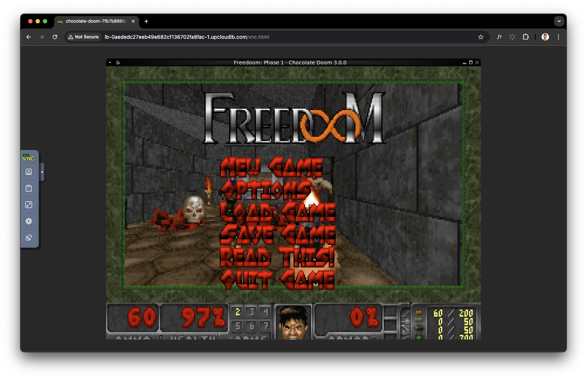
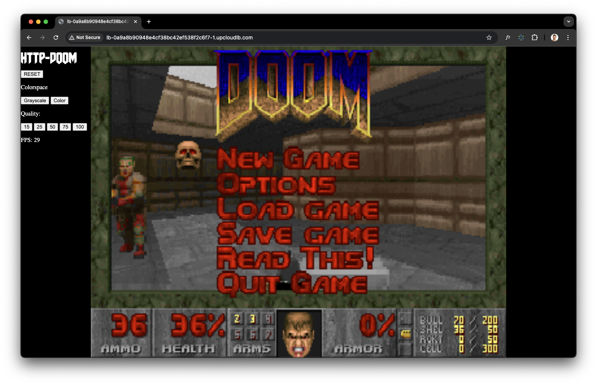

# UpCloud & Doom

This solution demonstrates how to run the original [Doom](https://cs.wikipedia.org/wiki/Doom) game on a Kubernetes cluster hosted on [UpCloud](https://upcloud.com/). The process involves building a Docker image that runs Doom (complete with a virtual X server and VNC/noVNC for remote access), pushing that image to a container registry, and then deploying it on Kubernetes.

> [!NOTE]
> This repository is a proof-of-concept and not intended for production use. While you could deploy Doom directly on an UpCloud managed server, this approach showcases the fun and flexibility of containerized deployments. Feel free to adapt the method for any retro open source game or use it as a stepping stone before diving into full-scale Kubernetes deployments.

The repository outlines **two approaches**:

1. **Easy Way – Getting Started**

   - Use a community-provided image (or mine)
   - Deploy it on UpCloud Managed Kubernetes
   - Follow the [Getting Started](#getting-started--easy-way) section for detailed steps

1. **Hard Way – Build from Scratch**

   - Research and build your own Docker image with Doom and a browser-based gaming system
   - Deploy your custom image on UpCloud Managed Kubernetes
   - Refer to the [Build from Scratch](#build-from-scratch--the-hard-way) section for insights



---

## Prerequisites

- An [UpCloud account](https://upcloud.com/) with a balance of at least €10 to enable Kubernetes pods.
- [kubectl](https://kubernetes.io/docs/tasks/tools/install-kubectl/) installed on your local machine.
- **👀 READ THIS - they have nice pictures** -> [UpCloud’s Managed Kubernetes Getting Started Guide](https://upcloud.com/docs/guides/get-started-managed-kubernetes/) 👀.

---

## Getting Started – Easy Way

1. **Clone the Repository**

   ```sh
   git clone https://github.com/Simply007/upcloud-doom.git
   cd upcloud-doom
   ```

2. **Obtain Your Kubernetes Configuration File**

   Get your kubeconfig file (e.g. `doom-dev_kubeconfig.yaml`) for your UpCloud Kubernetes cluster (named `doom-dev` in this example).

   > **IMPORTANT:**  
   > You can download the kubeconfig file either using the [UpCloud CLI (`upctl`)](https://github.com/UpCloudLtd/upcloud-cli) or via the UpCloud portal. Follow the instructions [here](https://upcloud.com/docs/guides/get-started-managed-kubernetes/#connecting-to-the-cluster) and save the file as `doom-dev_kubeconfig.yaml` in the repository root.

   ```sh
   upctl k8s cluster kubeconfig get doom-dev > doom-dev_kubeconfig.yaml
   # Alternatively, download it manually from the UpCloud portal.
   ```

   > **WARNING:**  
   > The kubeconfig file contains sensitive information about your cluster. Keep it secure and do not commit it to public repositories.

3. **Export the Kubeconfig File**

   ```sh
   export KUBECONFIG=$(pwd)/doom-dev_kubeconfig.yaml
   ```

   > [!TIP]
   > You can also set the `KUBECONFIG` environment variable in your shell profile (e.g. `~/.bashrc` or `~/.zshrc`) to avoid exporting it every time you start a shell.

4. **Deploy the Game**

   ```sh
   kubectl apply -f deployment.yaml
   ```

   > [!TIP]  
   > There’s also a file named `deployment-novnc.yaml` which deploys the [mattipaksula/http-doom:latest](https://hub.docker.com/r/mattipaksula/http-doom) image. This version uses no VNC and WebSockets to stream JPEG images to your browser. You can try it by running:
   >
   > ```sh
   > kubectl apply -f deployment-novnc.yaml
   > ```

   

5. **Monitor and Access the Service**

   Wait for the service IP to be assigned. You can watch the service status with:

   ```sh
   kubectl get svc chocolate-doom-service -w
   ```

   Once available, open your browser and navigate to:

   ```sh
   http://<service-ip>/vnc.html
   ```

   (For the noVNC version, you can also try `http://<service-ip>/`.)

🎉 **You made it!** Now connect and play Doom!

---

## Build from Scratch – The Hard Way

This section describes how I built the solution from the ground up before streamlining it into the easy method.

- **Analysis:**  
  The solution builds a Docker image that runs Doom along with a virtual X server and VNC/noVNC, pushes the image to a registry, and deploys it via Kubernetes. This method is adaptable to any retro open source game.

- **Choosing Chocolate Doom:**  
  Chocolate Doom is an open source port of the original Doom engine. Running Doom headlessly requires a virtual framebuffer (using Xvfb) and remote access via VNC or a browser-based interface like noVNC. (Refer to the [Gotchas](#gotchas) section for more info.)

- **Building a Docker Image:**  
  I created a Dockerfile that installs Chocolate Doom, Xvfb, and a VNC server. See [Dockerfile](./Dockerfile).

  Build the image with a multi-architecture approach (example):

  ```sh
  docker buildx build --platform linux/amd64,linux/arm64 -t simply007/chocolate-doom:latest .
  ```

- **Pushing the Image to a Registry:**

  ```sh
  docker push simply007/chocolate-doom:latest
  ```

- **Deploying the Image on Kubernetes:**

  ```sh
  kubectl apply -f deployment.yaml
  ```

- **Analyzing the Deployment:**

  Use the following commands to check your pod and service status:

  ```sh
  kubectl get pods
  kubectl describe pod <pod-name>
  kubectl get svc chocolate-doom-service -w
  ```

---

## Handy Commands

- **Get the Pods:**

  ```sh
  kubectl get pods
  ```

- **View Logs:**

  ```sh
  kubectl logs <POD_NAME>
  ```

- **Execute Commands in a Pod:**

  ```sh
  kubectl exec -it <POD_NAME> -- /bin/bash
  ```

- **Get the Service IP:**

  ```sh
  kubectl get svc chocolate-doom-service
  # or watch: kubectl get services -w
  ```

- **Delete the Deployment:**

  ```sh
  kubectl delete -f deployment.yaml
  ```

- **Deploy the Deployment:**

  ```sh
  kubectl apply -f deployment.yaml
  ```

- **Open a Shell in the Pod:**

  ```sh
  kubectl exec -it <POD_NAME> -- /bin/bash
  ```

---

## Gotchas

Throughout the process, I encountered a few pitfalls you should be aware of:

### upctl vs. kubectl

UpCloud provides a CLI for managing your Kubernetes cluster (`upctl`), but for deploying and managing applications, use `kubectl`.

### UpCloud Trial Restrictions

When using a trial account on UpCloud, Kubernetes pods might be disabled by default. You may need to contact UpCloud support or upgrade your account with a one-time payment of at least €10 to lift these restrictions.

The error if you don't have the trial restrictions lifted:

```plan
Kubernetes pods are currently disabled during trial. Please contact UpCloud support, or make a one-time payment of €10 or more to remove trial account restrictions.
```

### Docker Platform and Buildx

If you encounter errors like:

```
Failed to pull image "simply007/chocolate-doom:latest": pull access denied...
```

it might be due to an architecture mismatch. For instance, if your image is built for `linux/arm64` but your cluster nodes are `amd64`, you must rebuild your image using Docker Buildx for multi-architecture support.

### Doom Alternatives

You could also use a pre-built image (e.g. [mattipaksula/http-doom](https://hub.docker.com/r/mattipaksula/http-doom)) for a streamlined experience. However, this guide demonstrates the full build-from-scratch approach to highlight the process.

### Finding the IWAD File

To avoid proprietary files, I used Freedoom (available from [Freedoom](https://freedoom.github.io/download.html)) as a free alternative. Always check licensing and compatibility before use.

### Managed Kubernetes vs. Self-Hosted

Managed clusters can restrict access to some resources and can lead to some issues when troubleshooting, or trying to access some part of the Kubernetes cluster

```sh
kubectl logs <POD_NAME>
Error from server: Get "https://...:10250/containerLogs/default/...": No agent available
```

In such cases, you can try to use `kubectl exec` for in-pod troubleshooting, use k9s, or Lens to access Kubernetes insights, or reach out to Customer support for help.

### Game Setup Nuances

- The noVNC service might only work on specific ports 6080 did now rok for me, so I switched to 80.
- Audio and MIDI playback can be tricky in headless containers.
- Startup timing may require additional delays (using sleep commands) to ensure all services are ready before the game starts.

---

## Possible Improvements

- 💡 CI/CD deployment using i.e. GitHub actions (and make a PR to [GitHub templates](https://github.com/actions/starter-workflows/tree/main/deployments as Deploy to UpCloud to UKS)
- React to game events and trigger actions (e.g. sending a message to a Slack channel when a player dies)
- Implement a game server for multiplayer games
- Use persistent storage for save games and high scores
- Add a custom domain and SSL certificate for secure access
- Integrate with a cloud-based AI to play the game autonomously

---

## References

- [Chocolate Doom](https://www.chocolate-doom.org/)
- [Doom on Wikipedia](https://cs.wikipedia.org/wiki/Doom)
- [Xvfb Documentation](https://www.x.org/releases/)
- [noVNC](https://novnc.com/info.html)
- [Docker](https://www.docker.com/)
- [Kubernetes](https://kubernetes.io)
- [UpCloud Kubernetes Guide](https://upcloud.com/docs/guides/get-started-managed-kubernetes/)

Happy deploying—and have fun playing Doom on UpCloud!
